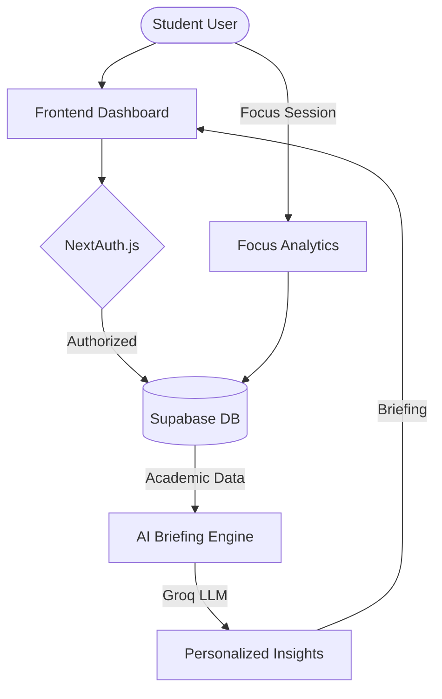
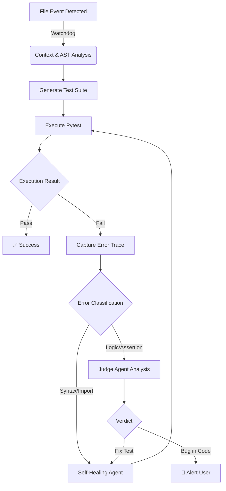

oPENSOURCE CONTRIBUTIONS:
Google JAX (Official Repository) 
Open Source Contributor: Merged PR #32046 aligning CUDA 13 installation instructions
pR LINK:
https://github.com/jax-ml/jax/pull/32046
hERE IS THE CONTENT OF THE README OF OTHER NEW PROJECTS ADDED, U THINK ABOUT IT:
Study Board:
<div align="center">
  
  <p><strong>The ultimate AI-powered command center for academic excellence.</strong></p>

  <p>
    
    
    
    
  </p>

  <p>
    <a href="#-features">Features</a> •
    <a href="#-architecture">Architecture</a> •
    <a href="#-tech-stack">Tech Stack</a> •
    <a href="#-setup">Setup</a> •
    <a href="#-project-structure">Structure</a>
  </p>
</div>

---

## 🚀 Overview

**StudyBoard** is a sophisticated, student-centric productivity platform that leverages artificial intelligence to streamline academic workflows. It unifies task management, focus tracking, and grade analytics into a single, cohesive dashboard designed to eliminate cognitive load and maximize student performance.

> [!IMPORTANT]
> **Free Forever Core**: StudyBoard is committed to providing its essential features for free to students everywhere.

---

## ✨ Features

### 🤖 AI-Powered Intelligence
*   **Daily Strategic Briefings**: Wake up to a generated summary of your day, highlighting critical deadlines and recommended focus blocks.
*   **Adaptive Scheduling**: AI-driven task prioritization based on your current energy levels and mood.

### ⏱️ Performance & Focus
*   **Deep Work Timer**: Integrated Pomodoro timer with streak tracking and ambient sound support.
*   **Focus Analytics**: Visualize your "Deep Work" hours and productivity trends.

### � Academic Excellence
*   **Grade Forecasting**: Real-time GPA calculations and predictive analytics for upcoming exams.
*   **Syllabus Management**: Keep track of subject requirements and progress in one place.

### 🎮 Behavioral Design
*   **Gamified Achievement System**: Earn XP for task completion and maintain daily streaks to level up your "Scholar Profile."

---

## 📐 Architecture

The following diagram illustrates how StudyBoard processes your academic data to provide AI-driven insights:



---

## 🛠️ Tech Stack

| Layer | Technology |
| :--- | :--- |
| **Frontend** | [Next.js 15+](https://nextjs.org/), [Tailwind CSS 4.0](https://tailwindcss.com/) |
| **UI Components** | [Shadcn UI](https://ui.shadcn.com/), [Framer Motion](https://www.framer.com/motion/) |
| **Backend/API** | Next.js App Router, [Groq SDK](https://groq.com/) |
| **Database/ORM** | [Prisma](https://www.prisma.io/), [Supabase/PostgreSQL](https://supabase.com/) |
| **Authentication** | [NextAuth.js](https://next-auth.js.org/) |
| **Communications** | [Resend](https://resend.com/) |

---

## 🏗️ Project Structure

```text
study_board/
├── app/                  # Next.js App Router (Pages & API)
│   ├── api/              # AI, Auth, and Database endpoints
│   ├── (auth)/           # Authentication flows
│   └── (dashboard)/      # Protected dashboard routes
├── components/           # Reusable UI components (Shadcn + Custom)
│   ├── academics/        # Grade & Syllabus components
│   └── focus/            # Timer & Analytics components
├── lib/                  # Shared utilities (Prisma client, AI helpers)
├── prisma/               # Database schema & migrations
└── public/               # Static assets & icons
```

---

## 🛠️ Setup & Local Development

### Prerequisites
- Node.js 18.x or later
- A PostgreSQL instance (Supabase recommended)

### 1. Installation
```bash
git clone https://github.com/tripathiji1312/study_board.git
cd study_board
npm install
```

### 2. Configuration
Copy the `.env.example` (or use the template below) into a `.env` file:

```env
DATABASE_URL="postgresql://..."
DIRECT_URL="postgresql://..."
NEXTAUTH_SECRET="your-secret-here"
NEXTAUTH_URL="http://localhost:3000"
GROQ_API_KEY="gsk_..."
```

### 3. Initialization
```bash
npx prisma generate
npx prisma db push
npm run dev
```

---

## 🤝 Contributing

We welcome contributions from the community! To contribute:
1.  **Fork** the repository.
2.  **Create** a new branch (`git checkout -b feature/amazing-feature`).
3.  **Commit** your changes (`git commit -m 'Add amazing feature'`).
4.  **Push** to the branch (`git push origin feature/amazing-feature`).
5.  **Open** a Pull Request.

---

## 📄 License

StudyBoard is released under the [MIT License](LICENSE).

<p align="center">Made with 🖤 by <a href="https://github.com/tripathiji1312">tripathiji1312</a></p>


Wesbite link: https://stubuddy.vercel.app/


Ghost:
<div align="center">


**Autonomous Test Generation & Self-Healing Agent for Python**

[](https://pypi.org/project/ghosttest/)
[](https://pypi.org/project/ghosttest/)
[](LICENSE)
[](https://github.com/psf/black)

</div>

---

## Overview

Ghost is a **local-first AI Agent** designed to automate the unit testing lifecycle for Python applications. It functions as a background daemon that monitors file system events in real-time.

Unlike standard code generators, Ghost employs a **continuous feedback loop**. When source code changes, Ghost analyzes the Abstract Syntax Tree (AST), generates context-aware `pytest`(or any other framework) suites, executes them in a secure subprocess, and autonomously patches the tests if they fail due to syntax or import errors.

It is designed for privacy and speed, with native support for **Ollama** (local LLMs), **Groq** (low-latency inference), OpenAI, and Anthropic.

---

## ⚡ Demonstration

### Continuous Watch Mode
*Ghost detects a file save, generates a test, identifies a syntax error, and autonomously heals the test code.*


### Project Initialization
*Setting up the environment and scanning project context.*


---

## Key Features

### 🔍 Context-Aware Generation
Ghost uses AST parsing to build a dependency graph of your project. This ensures that generated tests use correct relative imports, class instantiations, and function signatures, significantly reducing "hallucinated" code common in generic AI tools.

### 🛡️ Self-Healing Engine
The agent allows for autonomous error resolution. If a generated test fails:
1.  **Capture:** Ghost intercepts `stdout`, `stderr`, and Python stack traces.
2.  **Analyze:** The error context is fed back into the LLM.
3.  **Patch:** Ghost applies a fix to the test file (e.g., fixing imports, mocking missing dependencies).
4.  **Verify:** The test is re-run to confirm the fix.

### ⚖️ The "Judge" Protocol
To prevent "testing the implementation" (where tests are modified to match buggy code), Ghost implements a Logic verification step.
*   **Syntax/Runtime Errors:** Automatically fixed.
*   **Assertion Errors:** Analyzed by a secondary "Judge" agent. If the Judge determines the *source code* is likely buggy, Ghost halts and alerts the developer rather than altering the test expectation.

### 🔒 Local & Private
Ghost supports **Ollama** and **LM Studio**, allowing you to run models like Llama 3 or DeepSeek locally. Your source code never leaves your machine.

---

## Installation

Ghost is available on PyPI as `ghosttest`. We recommend installing it via `uv` or `pip`.

### Global Installation (Recommended)
Using `uv` allows you to run Ghost as a standalone command-line tool.

```bash
uv tool install ghosttest
```

### Standard Installation

```bash
pip install ghosttest
```

---

## Usage Guide

### 1. Initialization
Navigate to your project root and initialize the configuration. This creates a `ghost.toml` file and performs an initial scan of your project structure.

```bash
ghost init
```

### 2. Configuration
If using cloud providers, export your API keys. For local usage (Ollama), this step is not required.

```bash
# For Groq (Recommended for speed)
export GROQ_API_KEY=gsk_...

# For OpenAI
export OPENAI_API_KEY=sk-...
```

### 3. Start the Daemon
Start the file watcher. Ghost will now run in the background.

```bash
ghost watch
```

---

## Configuration

Ghost is configured via a `ghost.toml` file in your project root.

```toml
[project]
name = "my-application"
language = "python"

[ai]
# Options: groq, ollama, openai, anthropic, lmstudio
provider = "groq"
model = "llama-3.3-70b-versatile"
rate_limit_rpm = 30

[scanner]
# Directories to exclude from context analysis
ignore_dirs = [".venv", "node_modules", "dist", "__pycache__"]
ignore_files = ["setup.py", "conftest.py"]

[tests]
framework = "pytest"
output_dir = "tests"
auto_heal = true       # Enable automatic error fixing
max_heal_attempts = 3  # Prevent infinite repair loops
use_judge = true       # Enable logic verification logic
```

## CLI Reference

| Command | Description |
| :--- | :--- |
| `ghost init` | Initializes Ghost configuration and context map in the current directory. |
| `ghost watch` | Starts the daemon to monitor file changes and trigger workflows. |
| `ghost generate <file>` | Manually triggers generation for a specific file. |
| `ghost config` | Opens the interactive configuration wizard. |
| `ghost providers` | Lists supported AI providers and checks connectivity. |
| `ghost doctor` | Verifies installation, dependencies, and environment health. |

---

## Architecture

The following diagram illustrates the decision logic Ghost employs when a file modification event is detected.



---

## Contributing

Contributions are welcome. Please refer to `CONTRIBUTING.md` for guidelines on setting up the development environment.

1.  Fork the repository.
2.  Create a feature branch (`git checkout -b feature/new-capability`).
3.  Commit your changes (`git commit -m 'Add new capability'`).
4.  Push to the branch (`git push origin feature/new-capability`).
5.  Open a Pull Request.

## License

This project is licensed under the MIT License - see the [LICENSE](LICENSE) file for details.


Ask me any toher information if u need naything else